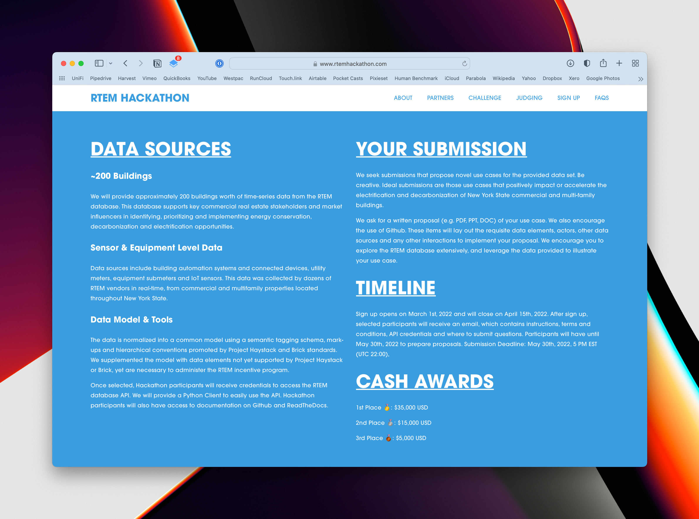
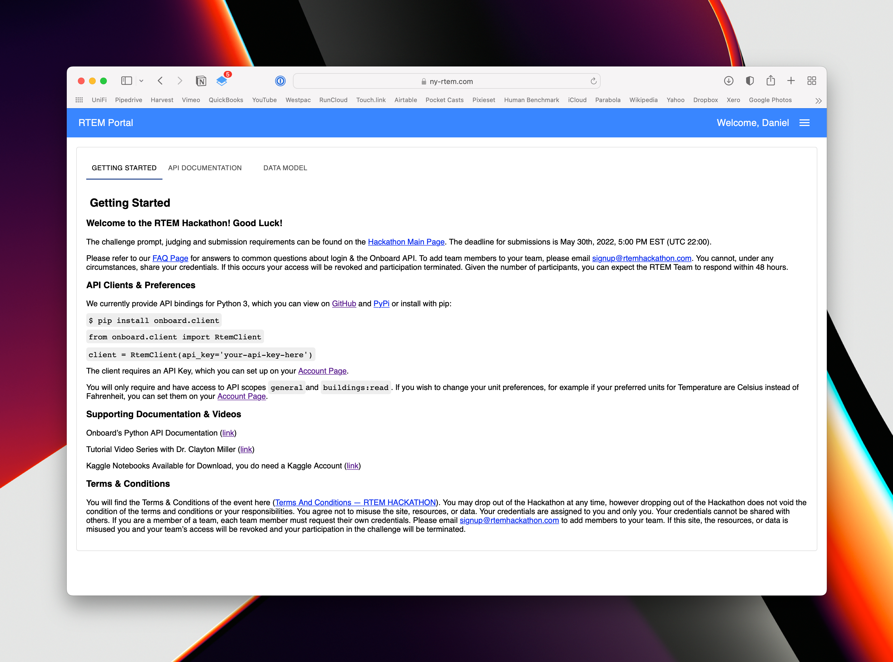
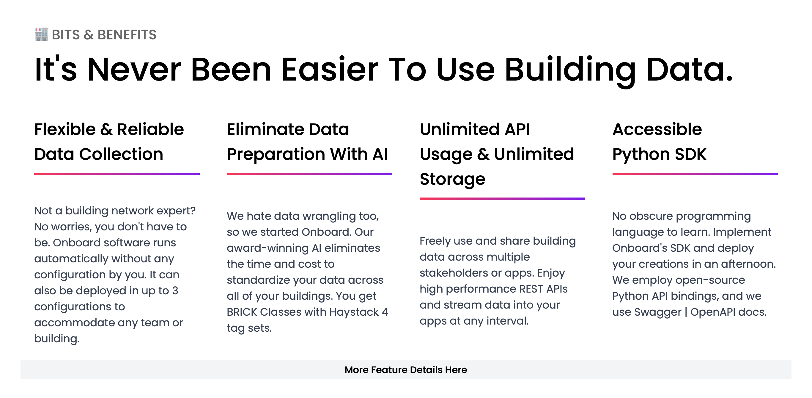

# rtem-hackathon

___

## Background

A few weeks ago, March 2022, I saw a callout on Reddit for sign-ups to the
NYSERDA
(New York State Energy Research & Development Authority) RTEM Hackathon. As I'm
writing this I'm in the middle of a career transition going from photographer to
programmer. I love data, and I couldn't pass up the prospect of having access to
a bunch of time-series data for a variety of buildings all over New York.

My undergrad was in Architecture so I come with a lot of passion for the built
environment already! I'm using this Hackathon as an opportunity to work on a
real-life project and develop my skills in data analytics and programming.

## The Brief

In 2016, NYSERDA launched the Real Time Energy Management Incentive Program
throughout NY State, empowering building owners to collect vital data about the
health and functioning of their buildings. They have provided data from over 200
buildings with an enormous collection of data points.

Ultimately, their goal is to further the attractiveness and success of their
RTEM program. They are seeking submissions that propose novel use cases and push
the boundaries of what we can learn and achieve using data from the built
environment.

> We seek submissions that propose novel use cases for the provided data set. Be
> creative. Ideal submissions are those use cases that positively impact or
> accelerate the electrification and decarbonization of New York State
> commercial and multi-family buildings. — RTEM Hackathon

## Judging Criteria

1. **Use Case Description & Demonstration** (10 Points)
    1. This score rates the novelty of your use case.
    2. Your submission must describe how the RTEM database is instrumental in
       your use case and how the growth of this database (>700 buildings) may
       impact your use case.
    3. In addition, your use case must identify the principal actors,
       activities, interactions, minimum data schema and necessary API
       functionalities associated with your use case.
    4. Finally, your submission must contain an illustration of your proposed
       use case using the provided API and existing data records.
2. **Market Adoption & Impact** (10 Points)
    1. This score rates the impact of your use case if it were integrated into
       the current RTEM Program.
    2. A key focus of NYSERDA is the accelerated adoption of RTEM Systems in New
       York State, without dependence on significant incentives/cost-share by
       New York State’s investor-owned utilities.
    3. As an example, use cases that demonstrate a more significant impact in
       growing the RTEM System Market and/or increase the confidence of building
       owners and operators to adopt an RTEM System will receive a higher score.
    4. The judges value technically interesting use cases; however, a high
       market impact is essential to receiving a high score in this category.
3. **Decarbonization through Electrification** (10 Points)
    1. This score rates your use case on its ability to promote building
       electrification and/or lowering a building’s carbon emission intensity.
    2. Decarbonization through electrification is the process of replacing
       fossil fuels with electricity.
    3. Electrification examples include switching from fossil fuel-fired sources
       of comfort and hot water heating (e.g. natural gas boilers), to
       in-building air-sourced heat pump heating, geothermal heat exchangers, or
       through a shared thermal network for a campus or neighborhood.
    4. As an example, a use case that demonstrates an acceleration of winter
       heating and domestic hot water in New York State would receive a high
       score.
4. **Ease of Implementation** (5 Points)
    1. This score rates the ease of implementing your use case, if NYSERDA were
       to adopt your submission.
    2. Submissions that utilize readily available skillsets and commonly
       available technologies provided by generally obtainable hosted
       environments will receive high scores.
    3. Additionally, any novel partnerships that the participant proposes to
       implement their submission may be favorably scored.
    4. Conversely, use cases, which require proprietary technology or skillsets
       will receive a lower score.
5. **Use of Open Data Sources** (5 Points)
    1. This score rates the use of open data elements to support your use case.
    2. Use cases that significantly incorporate the provided RTEM dataset will
       be ranked higher than others that do not.
    3. We encourage data fusion, and use cases that leverage open and publicly
       available datasets.
    4. If your use case depends on an external dataset, please include in your
       submission how NYSERDA might easily locate and/or access these new data
       elements.
    5. This description will assist us in evaluating how opaque, reliable and
       accessible these elements are in your submission.

## The Data

The Hackathon provides access to the RTEM Portal which is presumably the same
interface building owners and operators use in production environments. The RTEM
Program is delivered through the Onboard Data Platform who work with engineers
to provide access and storage of building data for analysis.

The Onboard platform provides an API, and a handy Python SDK with various
utilities access and make sense of the data.

## Ideas

I've had a few conversations with people about what exactly I could do with all
of this information. These were had before we were given access to the data
though so some early ideas were not possible with what we had been given.

### Concept 1: Conspicuous Consumption

The first concept I explored was the idea of a physical or digital dashboard
bringing awareness of consumption within the building benchmarked against other
similar buildings within the RTEM program.

Using historical data, the dashboard could show how current usage compares to
past figures and provide a simple indicator (red light/green light) if the
building is doing better or worse than usual.

More extreme versions of the idea split the building into floors, or even units
and having LED lights on your front door or letterbox. This would probably be
very effective in providing public shame to particularly wasteful residents but
I don't think it would be a popular program...

However, on an anonymised building-wide level, an indicator might nudge tenants
to be just a little bit better in their day-to-day life.

### Concept 2: Building as a Battery

The next idea was inspired by a video by Technology Connections on YouTube about
using a building as a thermal battery by shifting heating and cooling load to
times where energy is either cheap or green. By adjusting the target temperature
by a couple of degrees you could potentially use the entire building as a
massive battery, storing or shedding excess heat when it is cheaper and better
to do so.

The US Government, and NY State Government have great access to current and
historical electricity grid data including energy by source (coal, gas, solar,
nuclear etc.) It would be possible to estimate the amount of greenhouse gas
emissions as well as calculate cost savings.

#### Concept 2A: Cool-room as a Battery

Using Concept 2, could we set cool-room thermostats to cycle at a lower 
temperature while energy is clean and cheap, to reduce usage later on?

Is this even safe/legal? A fail-safe measure could make sure the cool-room 
never gets above a food-safe temperature.

### Concept 3: Power Factor Correction

By far the most boring, but probably most practical idea I've had is to identify
opportunities to install power factor correction equipment for buildings that
stand to benefit.

The TL;DR of Power Factor is that it's a ratio of the real power used, over the
total power (apparent power) needed from the grid to satisfy a given load. The
difference between real power and total power is known as reactive power.

Domestic users don't produce much reactive power, so they're not charged for it.
But commercial users are, because at larger scales poor power factor becomes a
big problem that causes stress and inefficiency in the grid.

Power Factor Correction Units are essentially large capacitor banks that 
compensate and improve power quality. Reducing reactive power not only 
reduces the electricity costs incurred by the consumer but also reduces 
strain on the network as a whole. 

The benefit of a Power Factor Correction Unit Program would be trivially 
demonstrable by using the RTEM Database combined with historical price data. 
Particularly extreme cases could achieve an ROI within a couple of years.

However, this idea is reactive not proactive (ironically) and the viability 
of PFC Units does not necessarily require a sophisticated RTEM system.

### Concept 4: Equipment Efficiency Losses Over Time
- Is equipment becoming less efficient over time?
- Increasing lifetime of equipment?
- Thermal losses?

## First Exploration of the Data

With those early ideas out of the way, let's actually start looking through 
the data we've got access to, to see if any insights start to appear. At 
least having some top-down visibility of the data will provide a good 
starting point.

<mark> Related: research/01_exploring_api.ipynb </mark>

### What Types of Buildings Are There?

| Building Types          |  0  |
|:------------------------|:---:|
| ('Multifamily',)        | 69  |
| ('Commercial Retail',)  | 49  |
| ('Commercial Office',)  | 46  |
| ('Healthcare',)         | 16  |
| ('Food/Beverage',)      | 13  |
| ('K-12 School',)        |  9  |
| ('College/University',) |  7  |
| ('Hospitality',)        |  7  |
| ('Not For Profit',)     |  5  |
| ('',)                   |  3  |
| ('Chemicals',)          |  1  |
| ('Manufacturing',)      |  1  |